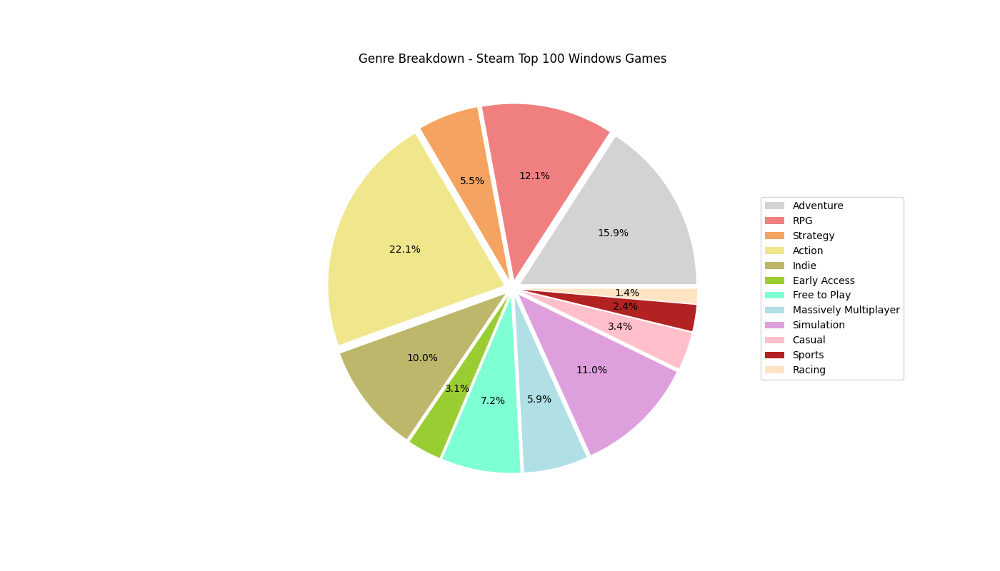
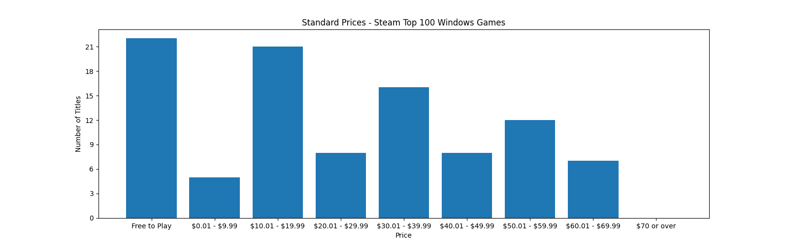
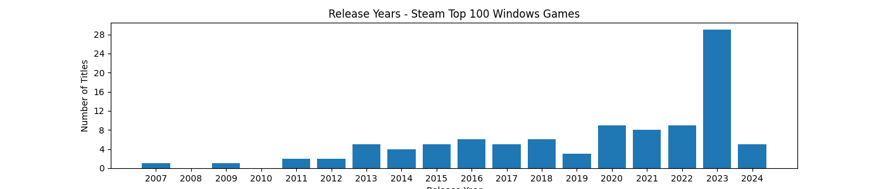
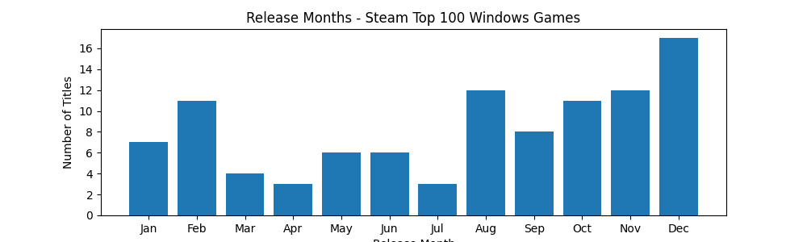

# Steam Top Sellers Data Visualization

## What is Steam?
Steam is one of the most well known video game distribution services for PC systems. Steam boasts ~120 million active users, with over 50,000 games available on the platform. Steam has a variety of ways that it ranks the games on the platforms, one of those being the "top sellers." Steam displays its top sellers [here](https://store.steampowered.com/search/?sort_by=_ASC&filter=topsellers&os=win&supportedlang=english&ignore_preferences=1).

## Project Overview
The goal of this project is to gather data about top selling Steam games. This project first gathers the URLs for each game from the Steam Top Sellers page, then scrapes data for each individual title.

Once the data is scraped, information about the genres, release dates, and prices of different subsets of games is displayed through graphs.

This project can be set up to use an existing CSV file rather than scraping new data by setting `use_existing_csv` to `True` and setting `csv_file_name` to the appropriate file name.
```
use_existing_csv = True
csv_file_name = 'steam_top_seller_data_06-01-2024_20-31-48.csv'
```

## Examples of Results




